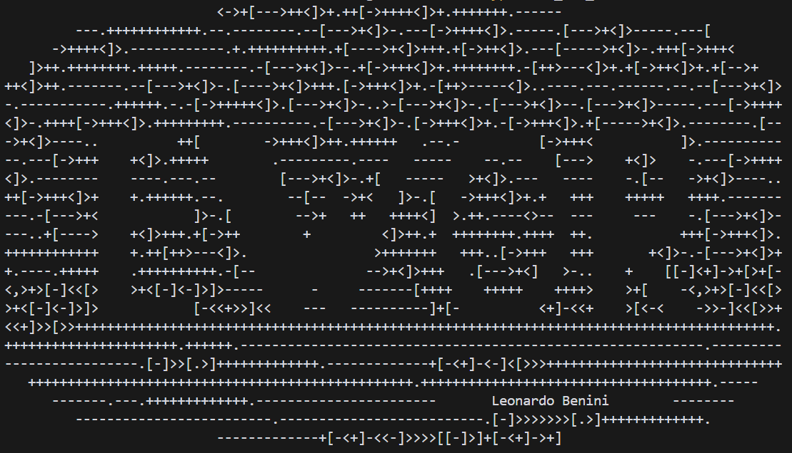
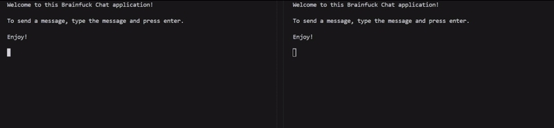
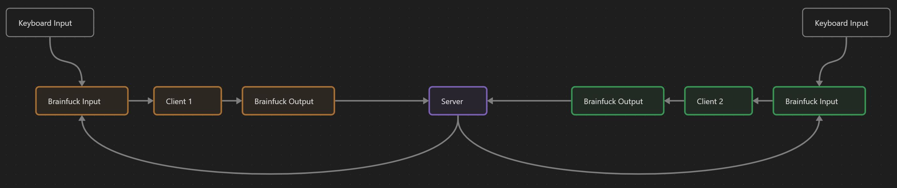

# Chat Application using Brainfuck



## Demo



## How to run

Run **one instance of the server** and **two instances of the client**.

```bash
python brainfuck.py server.bf
python brainfuck.py client.bf
```

You can also run ```asci_art_client.bf``` for the client, depending on your **aestetic preferences :D**.

## How it works



The main program is **client.bf**. It waits for input from a queue, which is filled by the users input (getch.py) or from the server. It then recognizes the origin of the message and outputs it whenever an "enter" is reached. So it waits for you to complete the message before sending it to the server.

If you typed the message, it gets a "You:" prefix, if it is from the other person it gets a "Other:" prefix.

The **server.bf** is a simple echo server. It waits for input from the client and then sends it back to the other client.

The networking is done using sockets in python. It forwards the output from the clients to the input of the server and vice versa.

The interpreter for the brainfuck code is also done in python (brainfuck.py).


#### Brainfuck Code Features

- **Anker Method**: Setting a cell to 255 to be able to come back to it from anywhere. (```+[-<+]-```)
- **While Loop**: Multiple while loops are used to wait for user input and the enter key.
- **if-statements**: if-statements are for example used to check if the user input is a "enter" or not.
- **if-else-statements**: if-else-statements are for example used to check if the message is from the user or the other client and print the prefix accordingly.
